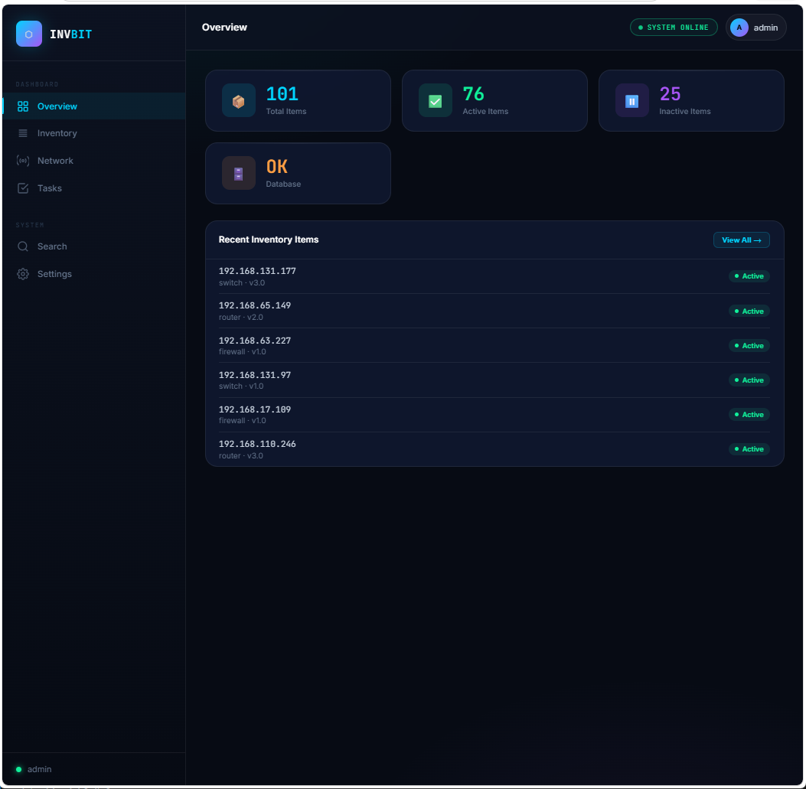
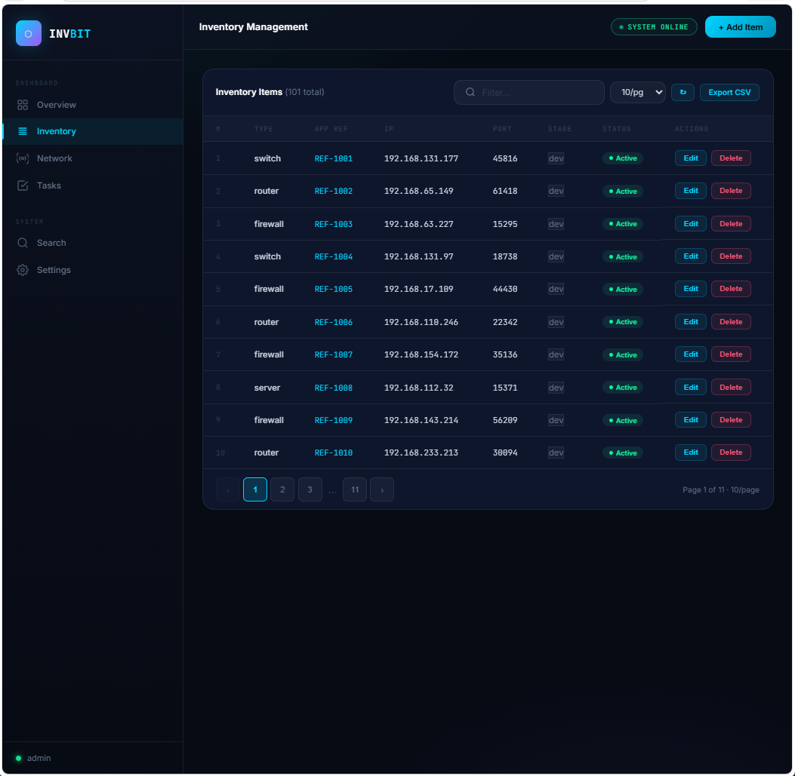
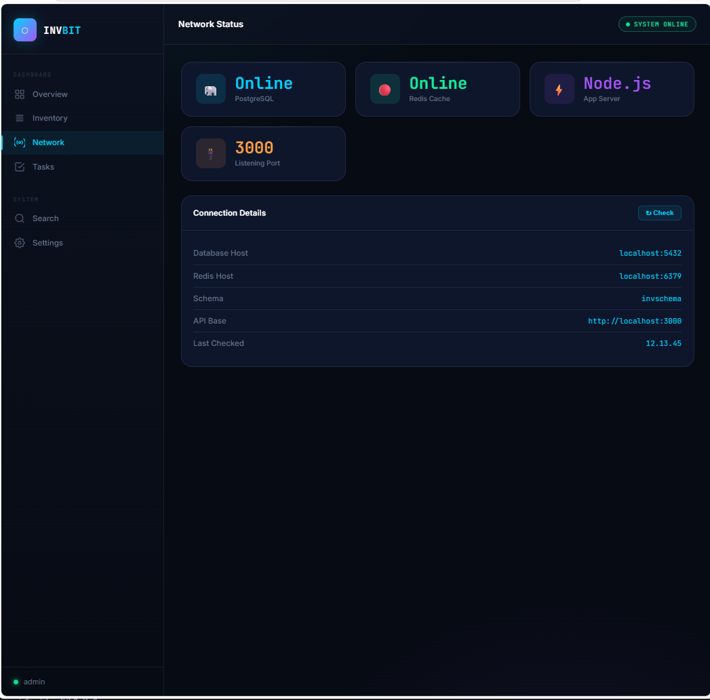
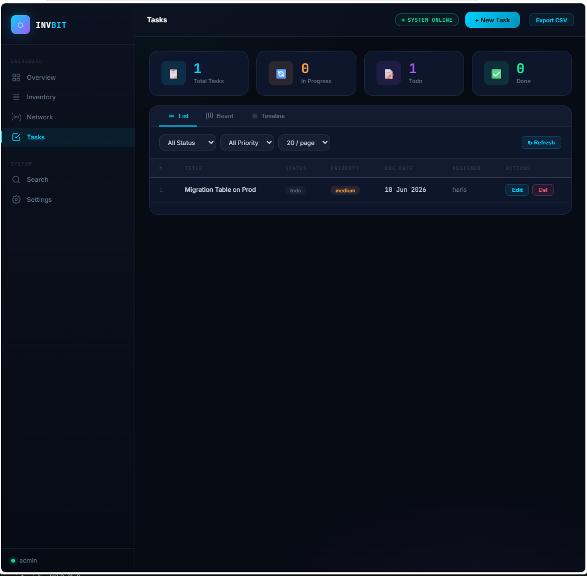
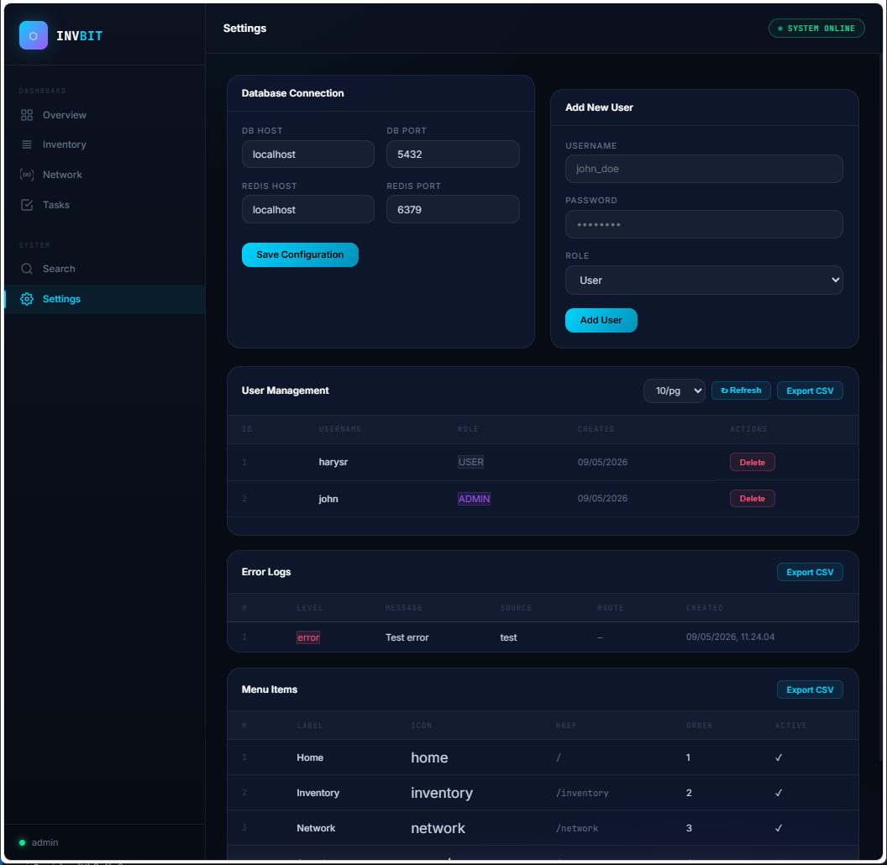
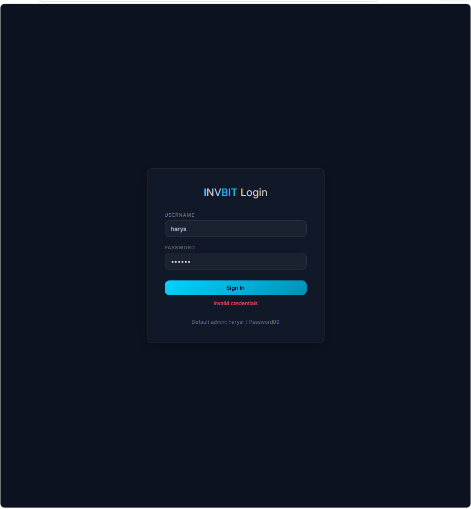

# INVDB — Inventory Management System

A full-stack inventory management system built with Node.js, Express, PostgreSQL, and Redis. Features a dark neon-blue themed UI with sidebar navigation, real-time health monitoring, and comprehensive data management.

<div align="center">
  
  
  
  
  
  
</div>

---

## Features

### Inventory Management
- Full CRUD operations (Create, Read, Update, Delete)
- Filter and search inventory items
- Pagination with configurable page sizes (10/20/50 per page)
- **Stage classification**: prod / uat / dev / other
- **Notes field** for additional item information
- Real-time statistics (total, active, inactive)
- Modal-based add/edit forms

### Task Management
- Kanban board view (Todo, In Progress, Done)
- Timeline view sorted by due date
- Priority levels: low / medium / high
- Due date tracking
- Status management

### User Management
- Create users with roles: user / dba / admin
- List users with pagination
- Delete users
- **Cache-aware** updates (new users appear immediately)

### Network Monitoring
- Real-time health checks for PostgreSQL and Redis
- Service status indicators
- Connection details display
- Auto-refresh every 30 seconds

### Error Logging
- Structured error logging to database
- Filterable by level, source, route
- View stack traces and metadata
- Delete old error logs
- Export error logs to CSV

### Menu System
- Dynamic sidebar menu stored in database
- Menu items: Home, Inventory, Network, Tasks, Search, Settings
- Order and visibility configurable via admin API
- Active/inactive toggle

### Data Export
- Export **any table** to CSV: inventory, tasks, users, menu_items, error_logs
- One-click export buttons on all listing pages
- Filename includes date: `table_export_YYYY-MM-DD.csv`
- Proper CSV escaping for special characters

### Authentication
- Session-based auth using localStorage
- Protected routes (all pages require login)
- Default admin credentials: `harysr / xcxcxc`
- Login page at `/login`
- Auto-redirect if not authenticated

### Database Migrations
- Versioned migrations with tracking table `schema_migrations`
- Idempotent SQL migrations
- Core schema + incremental changes
- Automatic on server start
- Migration files:
  - `000-core-schema.sql` — inventory, users, tasks tables
  - `001-menu-items.sql` — menu_items table + defaults
  - `002-error-logs.sql` — error_logs table
  - `003-add-inventory-columns.sql` — stage + note columns

### Caching Layer
- Redis-powered caching for inventory stats and paginated results
- Cache key patterns for bulk invalidation
- Graceful fallback if Redis unavailable
- TTL-based expiration

---

## Technology Stack

| Layer | Technology |
|-------|------------|
| Runtime | Node.js |
| Framework | Express.js |
| Database | PostgreSQL |
| Cache | Redis |
| Frontend | Vanilla HTML/CSS/JS |
| Styling | Custom CSS (dark neon-blue theme) |

---

## Project Structure

```
invdb/
├── inventory-app/
│   ├── server.js           # Main Express server (all API routes)
│   ├── db.js               # PostgreSQL connection pool
│   ├── cache.js            # Redis caching layer
│   ├── seed.js             # Test data seeder
│   ├── test-migrations.js  # Migration test script
│   ├── migrations/
│   │   ├── runner.js       # Migration runner
│   │   ├── 000-core-schema.sql
│   │   ├── 001-menu-items.sql
│   │   ├── 002-error-logs.sql
│   │   └── 003-add-inventory-columns.sql
│   └── .env                # Environment variables (gitignored)
├── public/
│   ├── index.html          # Dashboard
│   ├── inventory.html      # Inventory management
│   ├── tasks.html          # Task management (Kanban + List + Timeline)
│   ├── network.html        # Network health monitoring
│   ├── search.html         # Inventory search
│   ├── settings.html       # User management + Error logs + Menu items
│   ├── login.html          # Authentication page
│   ├── css/
│   │   └── style.css       # All styles (dark neon-blue theme)
│   └── imgs/               # Screenshots folder
├── .gitignore
├── .env.example            # Environment template
├── run.sh / run.bat        # Start server
├── push.sh / push.bat      # Push to GitHub
├── setup-github.sh / .bat  # GitHub credential setup
├── GITHUB_SETUP.md         # GitHub setup guide
├── TODO.md
└── README.md              # This file
```

---

## API Reference

### Inventory
| Method | Endpoint | Description |
|--------|----------|-------------|
| GET | `/inventory` | List inventory (pagination, filters) |
| GET | `/inventory/stats` | Get total/active/inactive counts |
| GET | `/inventory/:id` | Get single item |
| POST | `/inventory` | Create item (body: type, appreff, ip, port, version, active, stage, note, user_name, password) |
| PUT | `/inventory/:id` | Update item |
| DELETE | `/inventory/:id` | Delete item |

### Tasks
| Method | Endpoint | Description |
|--------|----------|-------------|
| GET | `/tasks` | List tasks (pagination, status/priority filter) |
| GET | `/tasks/board` | Kanban board grouped by status |
| GET | `/tasks/timeline` | All tasks sorted by due date |
| POST | `/tasks` | Create task |
| PUT | `/tasks/:id` | Update task |
| DELETE | `/tasks/:id` | Delete task |

### Users
| Method | Endpoint | Description |
|--------|----------|-------------|
| GET | `/users` | List users (pagination) |
| POST | `/users` | Create user (body: username, password, role) |
| DELETE | `/users/:id` | Delete user |

### Authentication
| Method | Endpoint | Description |
|--------|----------|-------------|
| POST | `/auth/login` | Login (body: username, password) → returns user object |

### Menu
| Method | Endpoint | Description |
|--------|----------|-------------|
| GET | `/menu` | Active menu items for sidebar |
| GET | `/admin/menu` | All menu items (admin) |
| POST | `/admin/menu` | Create menu item |
| PUT | `/admin/menu/:id` | Update menu item |
| DELETE | `/admin/menu/:id` | Delete menu item |

### Error Logs
| Method | Endpoint | Description |
|--------|----------|-------------|
| POST | `/errors` | Log an error |
| GET | `/errors` | List errors (filters: level, source, route) |
| GET | `/errors/:id` | Get single error |
| DELETE | `/errors/:id` | Delete error |

### Export
| Method | Endpoint | Description |
|--------|----------|-------------|
| GET | `/export/:table` | Export table to CSV (tables: inventory, tasks, users, menu_items, error_logs) |

---

## Database Schema

### Core Tables

**inventory**
```sql
id          SERIAL PRIMARY KEY
type        VARCHAR(100)
appreff     VARCHAR(100)
ip          INET
port        INTEGER
version     VARCHAR(50)
active      BOOLEAN DEFAULT TRUE
stage       VARCHAR(20) CHECK (stage IN ('prod','uat','dev','other')) DEFAULT 'dev'
note        TEXT
user_name   VARCHAR(100)
password    VARCHAR(100)
created_at  TIMESTAMP DEFAULT CURRENT_TIMESTAMP
updated_at  TIMESTAMP DEFAULT CURRENT_TIMESTAMP
```

**tasks**
```sql
id          SERIAL PRIMARY KEY
title       VARCHAR(255) NOT NULL
description TEXT
status      VARCHAR(20) DEFAULT 'todo' CHECK (status IN ('todo','in-progress','done'))
priority    VARCHAR(20) DEFAULT 'medium' CHECK (priority IN ('low','medium','high'))
due_date    DATE
assigned_to VARCHAR(100)
created_at  TIMESTAMP DEFAULT CURRENT_TIMESTAMP
updated_at  TIMESTAMP DEFAULT CURRENT_TIMESTAMP
```

**users**
```sql
id          SERIAL PRIMARY KEY
username    VARCHAR(100) UNIQUE
password    VARCHAR(100)
role        VARCHAR(20) DEFAULT 'user' CHECK (role IN ('user','dba','admin'))
created_at  TIMESTAMP DEFAULT CURRENT_TIMESTAMP
```

**menu_items**
```sql
id          SERIAL PRIMARY KEY
label       VARCHAR(100) NOT NULL
icon        VARCHAR(50)
href        VARCHAR(255) UNIQUE NOT NULL
order_index INTEGER DEFAULT 0
active      BOOLEAN DEFAULT TRUE
parent_id   INTEGER REFERENCES menu_items(id)
created_at  TIMESTAMP DEFAULT CURRENT_TIMESTAMP
updated_at  TIMESTAMP DEFAULT CURRENT_TIMESTAMP
```

**error_logs**
```sql
id          SERIAL PRIMARY KEY
level       VARCHAR(20) DEFAULT 'error'
message     TEXT NOT NULL
stack       TEXT
source      VARCHAR(100)
route       VARCHAR(255)
method      VARCHAR(10)
user_id     INTEGER REFERENCES users(id)
ip_address  INET
user_agent  TEXT
metadata    JSONB
created_at  TIMESTAMP DEFAULT CURRENT_TIMESTAMP
```

---

## Setup & Installation

### Prerequisites
- Node.js (v14+)
- PostgreSQL (v12+)
- Redis (v6+)

### 1. Clone Repository
```bash
git clone https://github.com/harys-rifai/tencent-inc.git
cd tencent-inc
```

### 2. Install Dependencies
```bash
cd inventory-app
npm install
```

### 3. Configure Environment
```bash
cp .env.example .env
# Edit .env with your database and Redis credentials
```

Default `.env`:
```env
PG_HOST=localhost
PG_PORT=5432
PG_USER=postgres
PG_PASSWORD=Password09
PG_DATABASE=bitdb
PG_SCHEMA=invschema
REDIS_HOST=localhost
REDIS_PORT=6379
PORT=3000
```

### 4. Setup Database
```bash
# Create database and schema
psql -U postgres -c "CREATE DATABASE bitdb;"
psql -U postgres -d bitdb -c "CREATE SCHEMA invschema;"
psql -U postgres -d bitdb -c "GRANT ALL ON SCHEMA invschema TO postgres;"
```

### 5. Run Migrations & Seed Data
```bash
node inventory-app/server.js  # Migrations run automatically
node inventory-app/seed.js    # Insert test data
```

### 6. Start Server
```bash
# Linux/Mac
./run.sh

# Windows
run.bat
# or
node inventory-app/server.js
```

Server runs at: http://localhost:3000

### 7. Setup GitHub Credentials (for push)
```bash
./setup-github.sh     # Linux/Mac
setup-github.bat      # Windows
```
Enter your GitHub Personal Access Token with `repo` scope.

Then push:
```bash
./push.sh    # Linux/Mac
push.bat     # Windows
```

---

## Default Credentials

**Login Page:** http://localhost:3000/login

| Role | Username | Password |
|------|----------|----------|
| Admin | harysr | xcxcxc |
| DBA | john | Password09 |
| User | (create in Settings) | — |

---

## Development

### Running Tests
```bash
node inventory-app/test-migrations.js
```

### Manual Migration Run
```bash
node inventory-app/migrations/runner.js
```

### View Database
```bash
psql -U postgres -d bitdb -c "\dt invschema.*"
```

### Clear Redis Cache
```bash
redis-cli FLUSHALL
```

### Graceful Shutdown
Press `Ctrl+C` in server terminal. All connections are properly closed.

---

## Troubleshooting

### "Network error" on Network Status page
- Ensure PostgreSQL is running: `pg_ctl status` or `service postgresql status`
- Ensure Redis is running: `redis-cli ping` should return `PONG`
- Check `.env` file for correct host/port settings
- Verify database exists: `psql -l`

### "Invalid credentials" when pushing
- Re-run `setup-github.sh` to refresh token
- Ensure token has `repo` scope
- Delete `.git-credentials` and set up again

### Users not appearing in Settings after creation
- The cache auto-invalidates on user create/delete
- Try refreshing the page (↻ button)
- Check Redis is running for cache invalidation to work

### Migration fails
- Check database connectivity
- Ensure `invschema` exists: `CREATE SCHEMA IF NOT EXISTS invschema;`
- Drop migrations table to re-run: `DROP TABLE IF EXISTS invschema.schema_migrations;`

### Port already in use
```bash
# Kill process on port 3000
# Linux/Mac
lsof -ti:3000 | xargs kill -9

# Windows
netstat -ano | findstr :3000
taskkill /PID <PID> /F
```

---

## Security Notes

- Passwords are stored in plain text (for demo purposes only — **use bcrypt in production**)
- Authentication uses localStorage (vulnerable to XSS — consider HTTP-only cookies in production)
- API endpoints have no rate limiting
- Error logs may contain sensitive data — secure in production
- GitHub token stored in `.git-credentials` (local only, never committed)

---

## Future Enhancements

- [ ] JWT authentication with refresh tokens
- [ ] BCrypt password hashing
- [ ] Audit logging for all admin actions
- [ ] CSV import functionality
- [ ] Advanced filtering with multiple criteria
- [ ] Real-time updates via WebSockets
- [ ] Docker containerization
- [ ] Rate limiting on API endpoints
- [ ] Role-based access control (RBAC) middleware

---

## License

ISC

---

**Built by Kilo** — Your AI-powered software engineering assistant.
